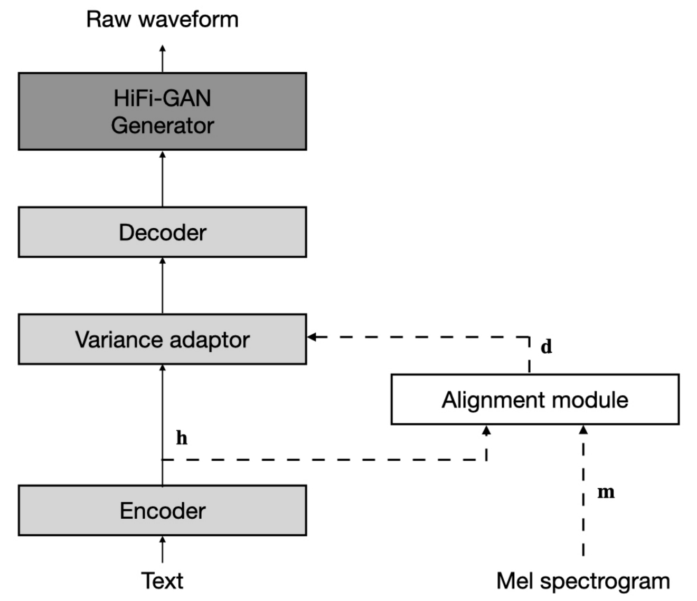
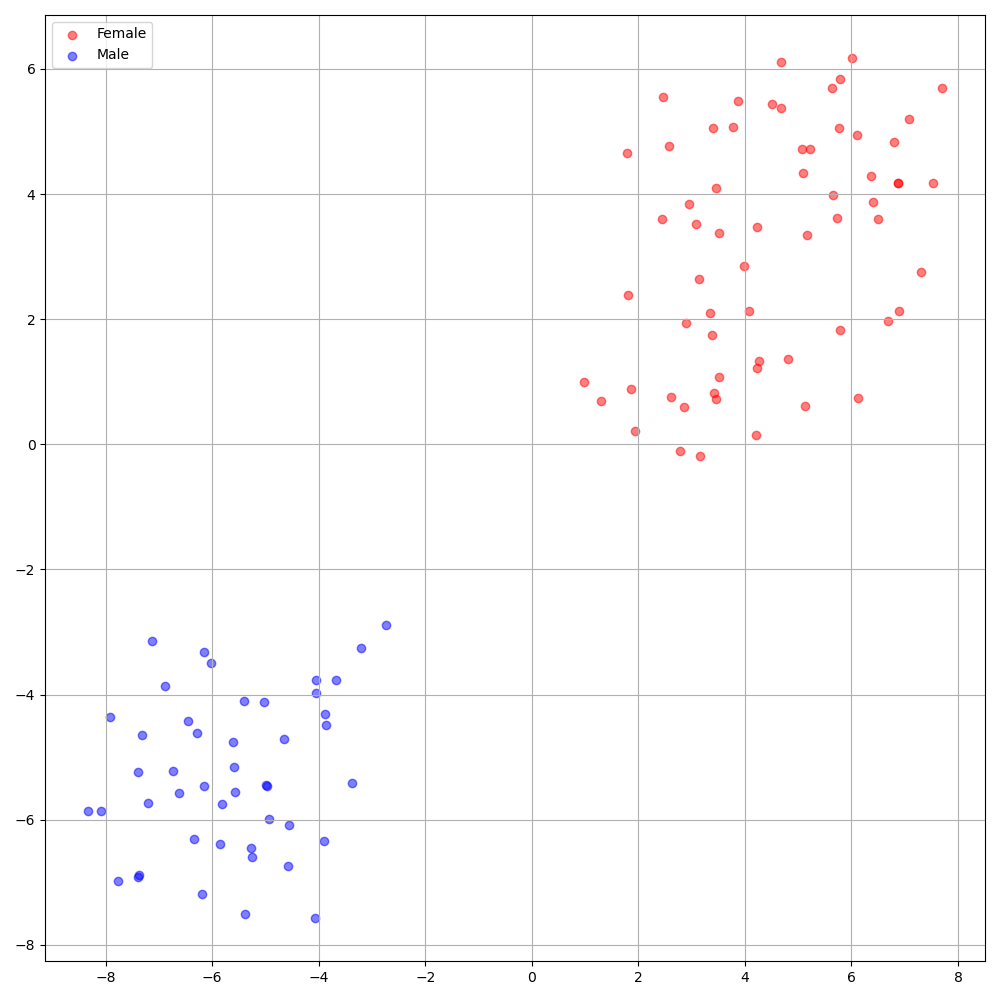

# Comprehensive-E2E-TTS - PyTorch Implementation

**A Non-Autoregressive End-to-End** Text-to-Speech (generating waveform given text), supporting a family of SOTA unsupervised duration modelings. This project grows with the research community, **aiming to achieve the ultimate E2E-TTS**. Any suggestions toward the best End-to-End TTS are welcome :)

<p align="center">
    
</p>

### Architecture Design
- [ ] [WavThruVec: Latent speech representation as intermediate features for neural speech synthesis](https://arxiv.org/abs/2203.16930) (Siuzdak et al., 2022)
- [x] [JETS: Jointly Training FastSpeech2 and HiFi-GAN for End to End Text to Speech](https://arxiv.org/abs/2203.16852) (Lim et al., 2022)

### Linguistic Encoder
- [x] [FastSpeech 2: Fast and High-Quality End-to-End Text to Speech](https://arxiv.org/abs/2006.04558) (Ren et al., 2020)

### Audio Upsampler
- [ ] [HiFi++: a Unified Framework for Neural Vocoding, Bandwidth Extension and Speech Enhancement](https://arxiv.org/abs/2203.13086) (Andreev et al., 2022)
- [x] [HiFi-GAN: Generative Adversarial Networks for Efficient and High Fidelity Speech Synthesis](https://arxiv.org/abs/2010.05646) (Kong et al., 2020)

### Duration Modeling
- [ ] [Differentiable Duration Modeling for End-to-End Text-to-Speech](https://arxiv.org/abs/2203.11049) (Nguyen et al., 2022)
- [x] [One TTS Alignment To Rule Them All](https://arxiv.org/abs/2108.10447) (Badlani et al., 2021)

<!-- ## Audio Samples
Audio samples are available at [/demo]() -->

# Quickstart

***DATASET*** refers to the names of datasets such as `LJSpeech` and `VCTK` in the following documents.

## Dependencies
You can install the Python dependencies with
```
pip3 install -r requirements.txt
```
Also, `Dockerfile` is provided for `Docker` users.

## Inference

You have to download the [pretrained models]() (will be shared soon) and put them in `output/ckpt/DATASET/`.

For a **single-speaker TTS**, run
```
python3 synthesize.py --text "YOUR_DESIRED_TEXT" --restore_step RESTORE_STEP --mode single --dataset DATASET
```

For a **multi-speaker TTS**, run
```
python3 synthesize.py --text "YOUR_DESIRED_TEXT" --speaker_id SPEAKER_ID --restore_step RESTORE_STEP --mode single --dataset DATASET
```

The dictionary of learned speakers can be found at `preprocessed_data/DATASET/speakers.json`, and the generated utterances will be put in `output/result/`.


## Batch Inference
Batch inference is also supported, try

```
python3 synthesize.py --source preprocessed_data/DATASET/val.txt --restore_step RESTORE_STEP --mode batch --dataset DATASET
```
to synthesize all utterances in `preprocessed_data/DATASET/val.txt`.

## Controllability
The pitch/volume/speaking rate of the synthesized utterances can be controlled by specifying the desired pitch/energy/duration ratios.
For example, one can increase the speaking rate by 20 % and decrease the volume by 20 % by

```
python3 synthesize.py --text "YOUR_DESIRED_TEXT" --restore_step RESTORE_STEP --mode single --dataset DATASET --duration_control 0.8 --energy_control 0.8
```
Add ***--speaker_id SPEAKER_ID*** for a multi-speaker TTS.

# Training

## Datasets

The supported datasets are

- [LJSpeech](https://keithito.com/LJ-Speech-Dataset/): a **single-speaker** English dataset consists of 13100 short audio clips of a female speaker reading passages from 7 non-fiction books, approximately 24 hours in total.
- [VCTK](https://datashare.ed.ac.uk/handle/10283/3443): The CSTR VCTK Corpus includes speech data uttered by 110 English speakers (**multi-speaker TTS**) with various accents. Each speaker reads out about 400 sentences, which were selected from a newspaper, the rainbow passage and an elicitation paragraph used for the speech accent archive.

Any of both **single-speaker TTS** dataset (e.g., [Blizzard Challenge 2013](https://www.synsig.org/index.php/Blizzard_Challenge_2013)) and **multi-speaker TTS** dataset (e.g., [LibriTTS](https://openslr.org/60/)) can be added following LJSpeech and VCTK, respectively. Moreover, **your own language and dataset** can be adapted following [here](https://github.com/keonlee9420/Expressive-FastSpeech2).

## Preprocessing

- For a **multi-speaker TTS** with external speaker embedder, download [ResCNN Softmax+Triplet pretrained model](https://drive.google.com/file/d/1F9NvdrarWZNktdX9KlRYWWHDwRkip_aP) of [philipperemy's DeepSpeaker](https://github.com/philipperemy/deep-speaker) for the speaker embedding and locate it in `./deepspeaker/pretrained_models/`.
- Run the preprocessing script by
  ```
  python3 preprocess.py --dataset DATASET
  ```

## Training

Train your model with
```
python3 train.py --dataset DATASET
```
Useful options:
<!-- - To use [Automatic Mixed Precision](https://pytorch.org/tutorials/recipes/recipes/amp_recipe.html), append `--use_amp` argument to the above command. -->
- The trainer assumes single-node multi-GPU training. To use specific GPUs, specify `CUDA_VISIBLE_DEVICES=<GPU_IDs>` at the beginning of the above command.

# TensorBoard

Use
```
tensorboard --logdir output/log
```

to serve TensorBoard on your localhost.
<!-- The loss curves, synthesized mel-spectrograms, and audios are shown.


 -->

# Notes

- Two options for embedding for the **multi-speaker TTS** setting: training speaker embedder from scratch or using a pre-trained [philipperemy's DeepSpeaker](https://github.com/philipperemy/deep-speaker) model (as [STYLER](https://github.com/keonlee9420/STYLER) did). You can toggle it by setting the config (between `'none'` and `'DeepSpeaker'`).
- DeepSpeaker on VCTK dataset shows clear identification among speakers. The following figure shows the T-SNE plot of extracted speaker embedding.

<p align="center">
    
</p>

# Citation

Please cite this repository by the "[Cite this repository](https://github.blog/2021-08-19-enhanced-support-citations-github/)" of **About** section (top right of the main page).

# References
- [keonlee9420's Comprehensive-Transformer-TTS](https://github.com/keonlee9420/Comprehensive-Transformer-TTS)
- [keonlee9420's DiffGAN-TTS](https://github.com/keonlee9420/DiffGAN-TTS)
- [jik876' hifi-gan](https://github.com/jik876/hifi-gan)
